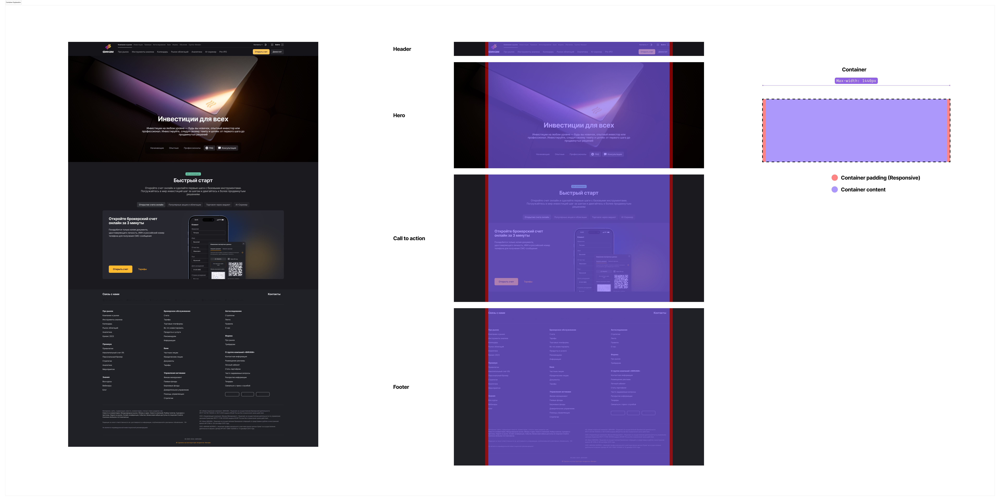
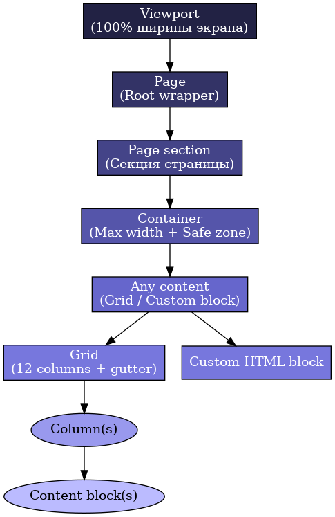

# 📑 Anatomy of a Page Layout

Документ фиксирует структуру страницы и терминологию для LLM, чтобы при генерации интерфейсов всегда соблюдались правила контейнеров и семантики.

---

## Иерархия структурных элементов

1. **Viewport** — вся область окна браузера/экрана устройства. Управляет адаптивностью и breakpoints.  
2. **Page (Root wrapper)** — главный контейнер страницы, обёртка внутри Body, которая содержит все Page section.
3. **Page section** — крупные стуктурные блоки страницы (Header, Hero, Call-to-action, FAQ, Footer и др.). Внутри секции всегда находится Section container.  
4. **Section container** — обёртка внутри Section container, ограничивающая ширину контента, имеющая центрирование и Safe zone (padding).  
5. **Any content (Grid / Custom html)** — наполнение контейнера:  
   - **Grid** — Колоночная система (например, выполненная на CSS Grids), используется для композиционного выравнивания контента и блоков.  
   - **Custom html** — произвольный html-контент, блоки, формы и тд.  

---

## Пример лендинга с разбивкой на секции (визуализация)




---

## Структурная схема

```
Viewport (100%)
└── Page (root wrapper)
    └── Page section
        └── Container (max-width + safe zone padding)
            └── Any content:
                ├── Grid (12 columns + gutter)
                │   └── Column(s) → Content block(s)
                └── Custom HTML block
```

---

## Схема (визуализация)



---

## Breakpoints и Container Width

| Breakpoint | Диапазон     | Safe zone (padding) |
|------------|--------------|---------------------|
| **XS**     | < 480px      | 16px                |
| **S**      | 480–767      | 20px                |
| **M**      | 768–1023     | 20px                |
| **L**      | 1024–1439    | 24px                |
| **XL**     | 1440–1919    | 24px                |
| **2XL**    | ≥1920px      | 24px                |

Max-width контейнера: 1440px

---

## Пример HTML-разметки

```html
<body>
  <div class="page">
    <header class="page-section header">
      <div class="container">
        <div class="header-content">
          <!-- header content -->
        </div>
      </div>
    </header>

    <section class="page-section hero">
      <div class="container">
        <div class="custom-block">
          <!-- hero content -->
        </div>
      </div>
    </section>

    <section class="page-section call-to-action">
      <div class="container">
        <div class="grid">
          <!-- CTA content -->
        </div>
      </div>
    </section>

    <footer class="page-section footer">
      <div class="container">
        <div class="grid">
          <!-- footer content -->
        </div>
      </div>
    </footer>
  </div>
</body>
```

---

## Ключевые правила для LLM

- **Page** всегда один на страницу.  
- **Page section** — модульные блоки, каждый независим.  
- **Container** — фиксирует max-width и safe zone, обязательный уровень.  
- **Any content** — внутри контейнера допускается grid или кастомные блоки.  
- **Safe zone** — предотвращает прилипание контента к краям экрана.  

---

